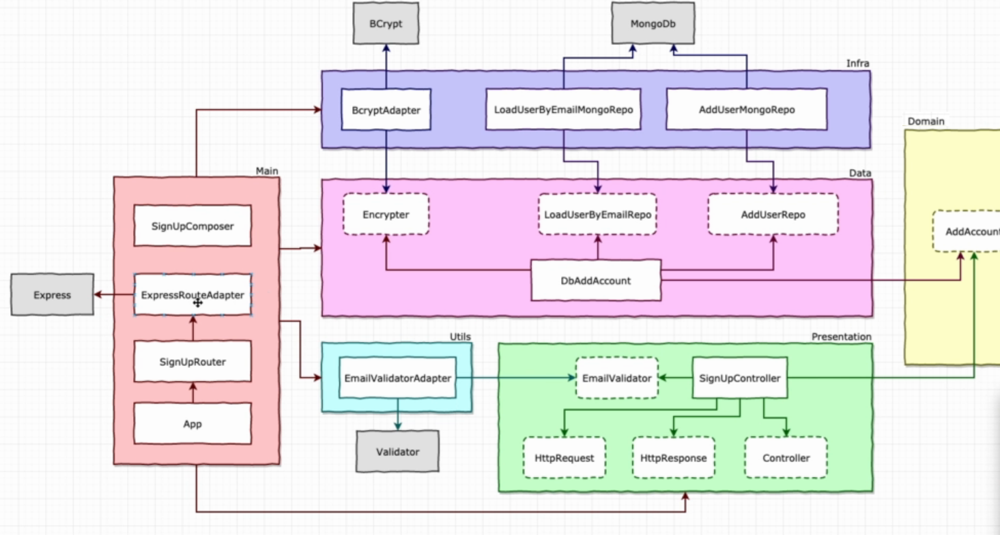

# NodeJs, Typescript, TDD, Clean Architecture and SOLID

> ## APIs
1. [SignUp](./requirements/signup.md)
1. [Login](./requirements/login.md)
1. [Create Survey](./requirements/add_survey.md)
1. [List Surveys](./requirements/surveys.md)
1. [Answer Survey](./requirements/answer_survey.md)
1. [Survey Result](./requirements/survey_result.md)

> ## Principles applied:
* Single Responsibility Principle (SRP)
* Open Closed Principle (OCP)
* Liskov Substitution Principle (LSP)
* Segregation Principle Interface (ISP)
* Dependency Inversion Principle (DIP)
* Don't Repeat Yourself (DRY)
* Composition Over Inheritance
* Small Commits

> ## Design Patterns applied:
* Factory
* Adapter
* Composite
* Decorator
* Dependency Injection
* Abstract Server
* Composition Root

> ## Architecture
